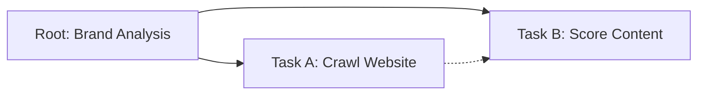

# Protocol Examples

This section demonstrates the protocol's core design philosophy using a **Minimal AEO Analysis** flow.

The goal is to show how **Hierarchy**, **Dependencies**, and **Schemas** work together to define a portable workflow.

## Scenario: Minimal Brand Analysis

We want to analyze a brand's website and generate a "Web Fit Score".
1.  **Step 1 (Crawl)**: Fetch content from `https://example.com`.
2.  **Step 2 (Score)**: Analyze the fetched content to calculate a score.

## Flow Structure



## JSON Representation

### 1. The Root (Container)
The root task holds the flow together. It defines the global goal.

```json
{
  "id": "root-task",
  "name": "Brand Analysis Flow",
  "status": "pending",
  "children": [ ... ]
}
```

### 2. Task A: Crawl Website (The Producer)
This task runs first. It uses the `web_crawler` method defined in its schema.

```json
{
  "id": "task-crawl",
  "parent_id": "root-task",
  "name": "Crawl Website",
  "status": "pending",
  "priority": 1,
  "inputs": {
    "url": "https://example.com"
  },
  "schemas": {
    "method": "web_crawler",
    "input_schema": {
      "type": "object",
      "required": ["url"],
      "properties": {
        "url": { "type": "string" }
      }
    }
  }
}
```

### 3. Task B: Score Content (The Consumer)
This task depends on `task-crawl`. It will not start until `task-crawl` is `completed`.
The `dependencies` array enforces this order.

```json
{
  "id": "task-score",
  "parent_id": "root-task",
  "name": "Score Content",
  "status": "pending",
  "priority": 2,
  "dependencies": [
    {
      "id": "task-crawl",
      "required": true
    }
  ],
  "inputs": {
    "criteria": "relevance"
  },
  "schemas": {
    "method": "content_scorer"
  }
}
```

## Why this Design?

1.  **Decoupling**: The `schemas` field tells the executor *what logic to run* (`web_crawler`, `content_scorer`). The protocol doesn't care about the Python/Go implementation of these methods, only that the task requests them.
2.  **Explicit Dependencies**: `task-score` explicitly waits for `task-crawl`. This makes the execution order deterministic.
3.  **Hierarchy**: Grouping tasks under `root-task` allows the entire flow to be managed (cancelled, monitored) as a single unit.
